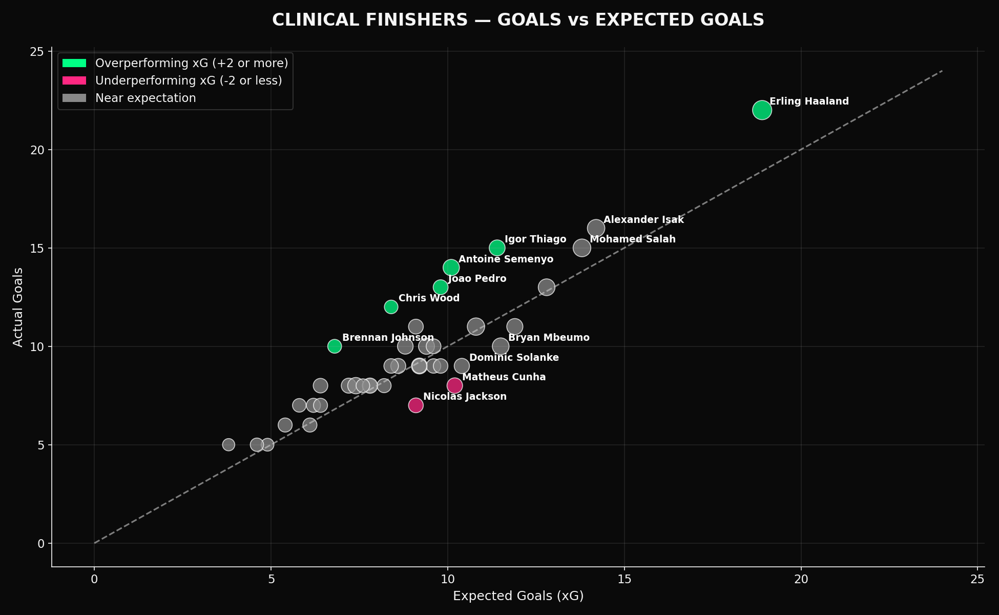

# Premier League 2025/26 — Finishing Quality Analysis

An end-to-end data analysis project that uses **Expected Goals (xG)** to separate
Premier League forwards who are genuinely clinical finishers from those whose
goal tallies are inflated (or suppressed) by variance.

**Stack:** Python · pandas · NumPy · Matplotlib

---

## The question

Goals alone are a noisy measure of finishing ability. A striker can outscore
their chance quality for a stretch of games purely by luck. **Expected Goals (xG)**
model the probability that each shot becomes a goal based on its location and
context. Comparing goals against xG lets us answer:

- Who is finishing *above* the quality of their chances (clinical)?
- Who is wasting high-quality chances (underperforming)?
- Whose output is likely to regress as the season progresses?

## Dataset

- 40 Premier League forwards and attacking midfielders (2025/26 season, through April 2026)
- 15 columns: `goals`, `assists`, `xG`, `xA`, `shots`, `shots_on_target`,
  `minutes`, `matches`, `penalties_scored`, `penalties_taken`, plus player
  demographics (team, position, nationality, age)
- Compiled from publicly reported figures in an FBref-compatible schema so the
  pipeline can be pointed at an FBref export with minor column renames

## Methodology

1. **Load & validate** the raw CSV (`load_and_enrich`)
2. **Feature engineering** — eight derived metrics:

   | Metric | Formula | What it measures |
   |---|---|---|
   | `xG_diff` | `goals - xG` | Over/underperformance of chance quality |
   | `non_pen_xG_diff` | strips penalty xG (0.79) | Same, without spot-kick noise |
   | `conversion_rate` | `goals / shots` | Raw efficiency per attempt |
   | `xG_per_shot` | `xG / shots` | Average chance quality generated |
   | `mins_per_goal` | `minutes / goals` | Rate of scoring output |
   | `goal_contributions` | `goals + assists` | Total attacking output |

3. **Visualization** — five charts targeting different analytical questions
4. **Insight extraction** — console-printed leaderboards for over/underperformers

## Visualizations

| # | Chart | Analytical question |
|---|-------|---------------------|
| 1 | Top 10 goalscorers | Who leads the raw count? |
| 2 | Goals vs xG scatter | Who is over/underperforming expectation? |
| 3 | Shot conversion rate (min. 40 shots) | Who is most clinical per shot? |
| 4 | Goals + Assists leaderboard | Who is the most complete attacker? |
| 5 | Efficiency quadrant | Who finds *and* converts high-quality chances? |



## Run it

```bash
pip install -r requirements.txt
python analysis.py
```

PNGs are written to `charts/` and summary tables print to stdout.

## Project structure

```
.
├── analysis.py                           # ETL + feature engineering + plotting
├── premier_league_2025_26_forwards.csv   # Source data
├── charts/                               # Generated PNG visualizations
├── requirements.txt
└── README.md
```

## Design notes

- **Modular functions.** Each chart is produced by a single pure function that
  takes a DataFrame and an output path, so individual visualizations can be
  regenerated or embedded elsewhere without rerunning the whole pipeline.
- **Configurable thresholds.** Volume filters (e.g. minimum shots, minimum
  minutes) are function arguments with sensible defaults, not hardcoded constants.
- **Reproducible styling.** A single `PLOT_STYLE` dict drives a consistent
  dark-themed visual language across every chart.
- **Portable schema.** The column names match FBref's standard stats export so
  the CSV can be swapped for a live download with minimal friction.

## Data provenance

The included CSV is a **curated dataset** assembled from publicly reported
2025/26 Premier League figures. It is schema-compatible with FBref's standard
stats export — for production use, replace the CSV with a fresh FBref download
and rerun the script.
